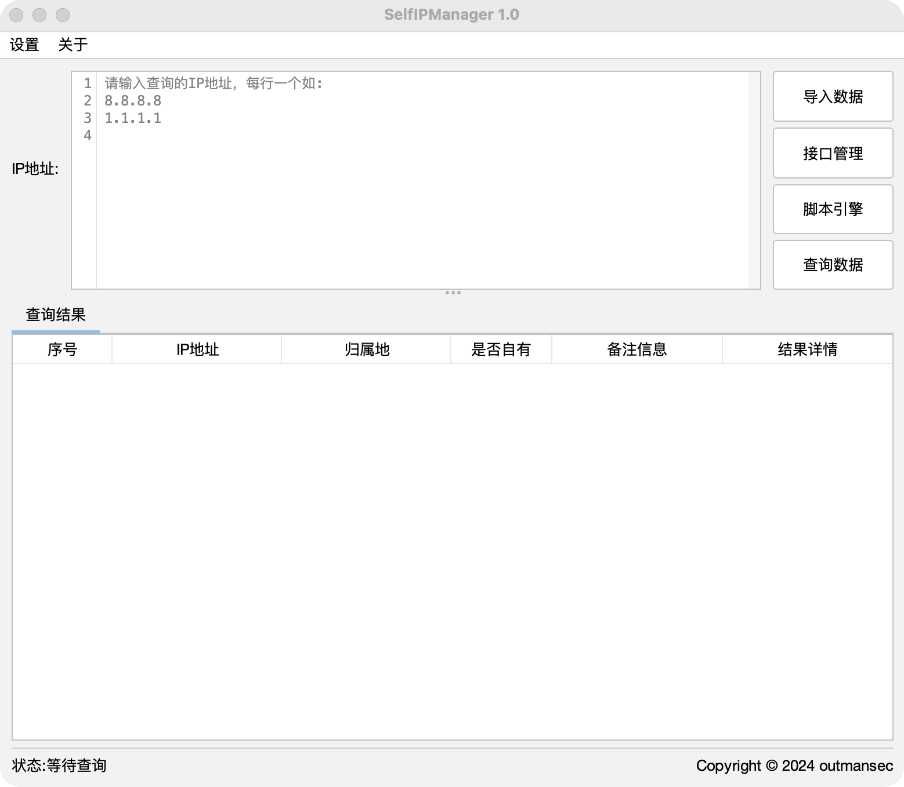

  <h1 align="center">SelfIPManager</h1>
  

    
    
    
  

  
一款java开发的全平台自有IP地址管理工具

  

    
  

 

> [!WARNING]
> 本工具仅供安全研究和学习使用。使用者需自行承担因使用此工具产生的所有法律及相关责任。请确保你的行为符合当地的法律和规定。作者不承担任何责任。如不接受，请勿使用此工具。

 

## 功能特点
- 自有查询：支持导入IP地址、IP地址段列表，实现自有地址进行统一查询。
- 归属查询：引入ip2region库实现本地查询IP地址归属地，这个过程你无需联网。
- 接口管理：你可以通过它实现基于HTTP接口功能调用。
- 脚本引擎：引入jython库实现python2脚本的支持，你只需根据规则编写脚本，无需安装额外的环境。
